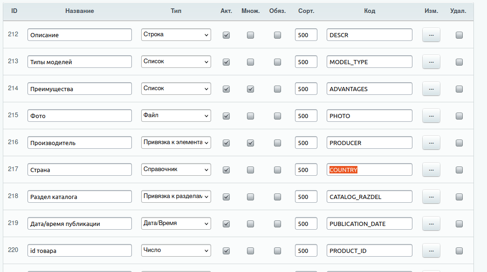

# Работа с ORM



```php

namespace Webpractik\Examples;

use Bitrix\Iblock\ORM\CommonElementTable;
use Bitrix\Iblock\SectionTable;
use Bitrix\Main\ORM\Fields\ExpressionField;
use Bitrix\Main\ORM\Fields\Relations\Reference;
use Bitrix\Main\ORM\Query\Join;

class OrmD7
{
 
    public function examaple(): void
    {
        \Bitrix\Main\Loader::includeModule('iblock');

        $catalogIblockId = 2;
        $catalogSectionsOrmClass = \Bitrix\Iblock\Model\Section::compileEntityByIblock($catalogIblockId);

        $catalogElementsOrmClass = \Bitrix\Iblock\Iblock::wakeUp($catalogIblockId)->getEntityDataClass();

        $highloadblockDataClass = \Bitrix\Highloadblock\HighloadBlockTable::compileEntity('Countries')->getDataClass();

        //Можно компиллировать сущность с элементами инфоблока как сделано в $catalogElementsOrmClass,
        //но лучше воспользоваться динамической компиляцией, укажите имя класса так  \Bitrxi\Iblock\Elements\Element***Table, где *** - API_CODE инфоблока
        $elementObjects = \Bitrix\Iblock\Elements\ElementTestTable::query()
            //СТАНДАРТНЫЕ ПОЛЯ ЭЛЕМЕНТА ИНФОБЛОКА
            ->addSelect('ID') //стандартное поле
            ->addSelect('NAME') //стандартное поле
            ->addSelect('DATE_CREATE') //стандартное поле, возвращает объект \Bitrix\Main\Type\DateTime
            ->addSelect('PREVIEW_PICTURE') //стандартное поле, возвращает id файла из таблицы b_file. Получить поля можно джойном класса FileTable
            ->addSelect('PREVIEW_TEXT') //стандартное поле

            //СВОЙСТВА ИНФОБЛОКА
            //Указываем имя свойства в addSelect, т.е. на первый взгляд выборка полей и свойств не отличается, но есть важное отличие.
            //Значение свойства всегда хранится как отдельный объект, поэтому у свойств есть субполя, в т.ч. VALUE где непосредственно хранится значение.

            //СТРОКА
            //Значение свойства - это всегда отдельный объект, у которого значение хранится в поле VALUE. Можно написать так:
            ->addSelect('DESCR') //свойство типа Строка, получим все поля значения свойства
            ->addSelect('DESCR.*') //аналогично предыдущему addSelect, просто явно указываем, что выбираем все поля
            ->addSelect('DESCR.VALUE') //тут хранится само значение - строка

            //Число
            ->addSelect('PRODUCT_ID')
            ->addSelect('PRODUCT_ID.*')
            ->addSelect('PRODUCT_ID.VALUE') //значение свойства - число

            //СПИСОК
            //Свойство типа Список, выбираем все поля значения свойства
            ->addSelect('MODEL_TYPE')
            //или так - явно выбираем все поля
            ->addSelect('MODEL_TYPE.*')
            //Обычно надо получить только значение свойства (для списка тут хранится id списочного значения), то можно выбрать только поле VALUE
            //Обратите внимание!!! Тут лежит id выбранного элемента списка.
            ->addSelect('MODEL_TYPE.VALUE')

            //Получаем поля элемента списка - происходит join таблицы с элементами списка
            ->addSelect('MODEL_TYPE.ITEM')
            //или, чтобы явно указать, что выбираем все поля
            ->addSelect('MODEL_TYPE.ITEM.*')
            //или, чтобы получить только текст элемента списка и не выбирать лишние поля
            ->addSelect('MODEL_TYPE.ITEM.VALUE')

            //ФАЙЛ
            //Получаем все поля значения свойства
            ->addSelect('PHOTO')
            //или так, чтобы явно указать, что выбираем все поля
            ->addSelect('PHOTO.*')
            //или так, чтобы получить только значение, в данном случае это id файла (таблица b_file)
            ->addSelect('PHOTO.VALUE')

            //если надо получить путь к файлу - происходит join таблицы  \Bitrix\Main\FileTable
            // делаем так, чтобы получить полностью объект EO_FILE, такой же как при запросе таблицы \Bitrix\Main\FileTable
            ->addSelect('PHOTO.FILE')
            //или так, чтобы явно указать, что выбираем все поля
            ->addSelect('PHOTO.FILE.*')
            //или так, чтобы выбрать нужные поля - их соединить и получиться путь к файлу
            ->addSelect('PHOTO.FILE.SUBDIR') //папка относительно /upload
            ->addSelect('PHOTO.FILE.FILE_NAME') //название файла

            //ПРИВЯЗКА К ЭЛЕМЕНТАМ ИНФОБЛОКА
            //Получаем все поля значения
            ->addSelect('PRODUCER')
            //или так, явно указываем, что выбираем все поля
            ->addSelect('PRODUCER.*')
            //или так, чтобы выбрать только поле со значением - тут будет лежать ID элемента другого инфоблока
            ->addSelect('PRODUCER.VALUE')

            //Получить поля привязанного элемента - происходит join таблицы инфоблока
            ->addSelect('PRODUCER.ELEMENT') //получить все поля привязанного элемента
            ->addSelect('PRODUCER.ELEMENT.*') //то же самое, только явно указали, что выбираем все поля
            //Вот пример выборки конкретных полей. Важно!!! Свойства привязанного элемента так получить не выйдет - только стандартные поля
            ->addSelect('PRODUCER.ELEMENT.NAME') //название элемента
            ->addSelect('PRODUCER.ELEMENT.CODE') //код элемента

            //ПРИВЯЗКА К РАЗДЕЛУ
            ->addSelect('CATALOG_RAZDEL')
            //или так, явно указываем, что выбираем все поля
            ->addSelect('CATALOG_RAZDEL.*')
            //или так, чтобы выбрать только поле со значением - тут будет лежать ID раздела инфоблока
            ->addSelect('CATALOG_RAZDEL.VALUE')

            //делаем join таблицы разделов
            ->addSelect('CATALOG_RAZDEL.SECTION')
            ->addSelect('CATALOG_RAZDEL.SECTION.*')
            //Получить значение конкретного поля раздела. Важно! Получить значения пользовательского поля раздела, например, UF_BROWSER_TITLE так нельзя
            ->addSelect('CATALOG_RAZDEL.SECTION.NAME')

            //ДАТА/ВРЕМЯ
            ->addSelect('PUBLICATION_DATE')
            ->addSelect('PUBLICATION_DATE')
            ->addSelect('PUBLICATION_DATE.VALUE') //значение представляет собой строку такого вида '2025-01-24 14:47:00'

            //СПРАВОЧНИК (привязка к хайлоаблоку)
            //Получаем все поля значения
            ->addSelect('COUNTRY')
            //или так, явно указываем, что выбираем все поля
            ->addSelect('COUNTRY.*')
            //или так, чтобы выбрать только поле со значением - тут будет лежать XML_ID элемента хайлоадблока
            ->addSelect('COUNTRY.VALUE')
            //Увы, никакого поля для получения элемента хайлоадблока не предусмотрено - надо получать через привязку хайалоадблока

            //JOIN ХАЙЛОАДБЛОКА
            //registerRuntimeField только join-ит таблицу, но не добавляет ее поля в выборку. Потом все равно нужно сделать addSelect
            ->registerRuntimeField(
                null, //всегда null
                (new Reference(
                    'REF_COUNTRIES', //произвольный код поля, которое будет использоваться для доступа к выбираемым полям.
                    $highloadblockDataClass,
                    Join::on('this.COUNTRY.VALUE', 'ref.UF_XML_ID'), //join делаем по XML_ID, потому что именно xml_id лежит в значение свойства
                ))->configureJoinType(Join::TYPE_INNER) //по умолчанию TYPE_LEFT
            )
            ->addSelect('REF_COUNTRIES')
            ->addSelect('REF_COUNTRIES.*')
            ->addSelect('REF_COUNTRIES.UF_NAME')

            //JOIN СТОРОННЕЙ ТАБЛИЦЫ (тут используется FileTable для поля PREVIEW_PICTURE, т.к. для него по другому не получишь поля файла
            ->registerRuntimeField(
                null, //всегда null
                (new Reference(
                    'REF_PREVIEW_PICTURE', //произвольный код поля, которое будет использоваться для доступа к выбираемым полям.
                    \Bitrix\Main\FileTable::class,
                    Join::on('this.PREVIEW_PICTURE', 'ref.ID'), //this - текущая таблица, ref - присоединяемая
                ))->configureJoinType(Join::TYPE_INNER) //по умолчанию TYPE_LEFT
            )
            ->addSelect('REF_PREVIEW_PICTURE')
            ->addSelect('REF_PREVIEW_PICTURE.*')
            ->addSelect('REF_PREVIEW_PICTURE.SUBDIR')
            ->addSelect('REF_PREVIEW_PICTURE.FILE_NAME')

            //JOIN компиллируемой ORM по разделам инфоблока, отличие от SectionTable - содержит разделы только одного инфоблока и можно получить поля UF_
            ->registerRuntimeField(
                null, //всегда null
                (new Reference(
                    'REF_CATALOG_RAZDEL_WITH_USERFIELDS', //произвольный код поля, которое будет использоваться для доступа к выбираемым полям.
                    $catalogSectionsOrmClass,
                    Join::on('this.CATALOG_RAZDEL.VALUE', 'ref.ID'),
                ))->configureJoinType(Join::TYPE_INNER) //по умолчанию TYPE_LEFT
            )
            ->addSelect('REF_CATALOG_RAZDEL_WITH_USERFIELDS')
            ->addSelect('REF_CATALOG_RAZDEL_WITH_USERFIELDS.*')
            ->addSelect('REF_CATALOG_RAZDEL_WITH_USERFIELDS.UF_BROWSER_TITLE')

            //JOIN компиллируемой ORM по элементам инфоблока, отличие от ElementTable - содержит элементы только одного инфоблока и можно получить свойства
            ->registerRuntimeField(
                null, //всегда null
                (new Reference(
                    'REF_CATALOG_ELEMENT', //произвольный код поля, которое будет использоваться для доступа к выбираемым полям.
                    $catalogElementsOrmClass,
                    Join::on('this.PRODUCT_ID.VALUE', 'ref.ID'),
                ))->configureJoinType(Join::TYPE_INNER) //по умолчанию TYPE_LEFT
            )
            ->addSelect('REF_CATALOG_ELEMENT')
            ->addSelect('REF_CATALOG_ELEMENT.*')
            ->addSelect('REF_CATALOG_ELEMENT.OIL.ITEM.VALUE')

            //ВЫЧИСЛЯЕМОЕ ПОЛЕ
            ->registerRuntimeField(
                null, //всегда null
                new ExpressionField(
                    'EXP_CALC', //произвольный код поля, которое будет использоваться для доступа к выбираемым полям.
                    '%s-5',
                    ['SORT'],
                )
            )
            ->addSelect('EXP_CALC')
            
            //Задать алиас для поля
            ->addSelect('ID', 'ELEMENT_ID')
            
            //Использования в where оператора ‘OR’
            ->where(Query::filter()
                ->logic('OR')
                ->whereLike('text.VALUE', '%'.$queryString.'%')
                ->whereLike('title.VALUE', '%'.$queryString.'%')
            )
            
            //Если нужно сохранить порядок переданных в WHERE IN элементов, т.к. по дефолту он приводит к ASC

            ->whereIn('ID', $elementIds)
            ->registerRuntimeField(new ExpressionField(
                'SORT',
                'FIELD(%s, ' . implode(', ', $elementIds) . ')',
                'ID'
             ))
            ->addOrder('SORT')
            
            //Для получения коллекции объектов
            ->fetchCollection();
            //Для получения массива как от обычного SQL запроса
            ->fetchAll();
            //Для получения одного объекта
            ->fetchObject();
            
        $items = [];
        foreach ($elementObjects as $elementObject) {
            $id = $elementObject->getId(); //возвращает тип int, приводить тип не надо
            $name = $elementObject->getName();
            $dateCreate = $elementObject->getDateCreate(); //возвращает объект типа \Bitrix\Main\Type\DateTime
            $previewPicture = $elementObject->getPreviewPicture();
            $previewText = $elementObject->getPreviewText();

            //Свойство типа "Список" - получаем текст выбранного элемента списка
            $modelTypeName = $elementObject->getModelType()->getItem()->getValue();

            //Свойство типа "Файл" - получаем путь к файлу
            $photoPath = '/upload/' . $elementObject->getPhoto()->getFile()->getSubdir() . '/' . $elementObject->getPhoto()->getFile()->getFileName();

            //Свойсто типа "Привязка к элементу инфоблока" - в данном случае множественное, для примера
            $producerElementObjects = $elementObject->getProducer(); //возвращает коллекцию объектов
            $producerNames = [];
            foreach ($producerElementObjects as $producerElementObject) {
                $producerNames[] = $producerElementObject->getElement()->getName();
            }

            //Свойство типа "Привязка к разделам инфоблока"
            $catalogRazdelName = $elementObject->getCatalogRazdel()->getSection()->getName();

            //Свойство дата/время
            $publicationDate = $elementObject->getPublicationDate()->getValue();

            //Свойство типа "Справочник"
            $countryXmlId = $elementObject->getCountry()->getValue();

            //JOIN хайлоаблока
            $countryName = $elementObject->get('REF_COUNTRIES')->getUfName();

            //JOIN СТОРОННЕЙ ТАБЛИЦЫ
            //Обратите внимание, что поле из Reference надо подключать так get('REF_CATALOG_RAZDEL'), а его поля можно уже получить методами
            $previewPictureFilePath = '/upload/' . $elementObject->get('REF_PREVIEW_PICTURE')->getSubdir() . '/' . $elementObject->get('REF_PREVIEW_PICTURE')->getFileName();

            //JOIN компиллируемой ORM по разделам инфоблока
            $catalogRazdelUfBrowserTitle = $elementObject->get('REF_CATALOG_RAZDEL_WITH_USERFIELDS')->getUfBrowserTitle();

            //JOIN компиллируемой ORM
            $productOilType = $elementObject->get('REF_CATALOG_ELEMENT')->getOil()->getItem()->getValue();

            //ВЫЧИСЛЯЕМОЕ ПОЛЕ
            $expCalc = $elementObject->get('EXP_CALC'); //получаем вычисляемые поля только через get

            $items[] = [
                'id' => $id,
                'name' => $name,
                'dateCreate' => $dateCreate,
                'previewPicture' => $previewPicture,
                'previewPictureFilePath' => $previewPictureFilePath,
                'previewText' => $previewText,
                'modelTypeName' => $modelTypeName,
                'photoPath' => $photoPath,
                'producerNames' => $producerNames,
                'catalogRazdelName' => $catalogRazdelName,
                'publicationDate' => $publicationDate,
                'catalogRazdelUfBrowserTitle' => $catalogRazdelUfBrowserTitle,
                'countryName' => $countryName,
                'countryXmlId' => $countryXmlId,
                'productOilType' => $productOilType,
                'expCalc' => $expCalc,
            ];
        }
        echo '<pre>';
        var_export($items);
        echo '</pre>';
        die();
    }
}
```